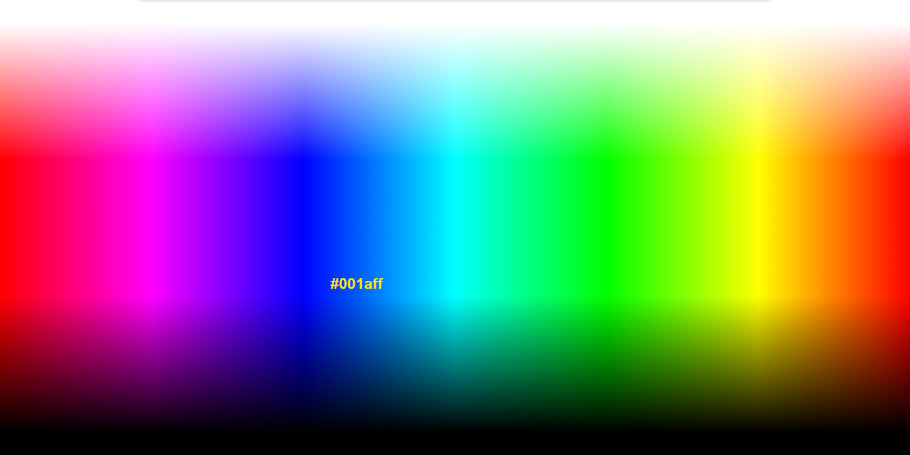

<a name="readme-top"></a>
<div align="center">
  
  [![Contributors][contributors-shield]][contributors-url]
  [![Forks][forks-shield]][forks-url]
  [![Stargazers][stars-shield]][stars-url]
  [![Issues][issues-shield]][issues-url]
  [![MIT License][license-shield]][license-url]
  [![LinkedIn][linkedin-shield]][linkedin-url]

</div>
<br />
<div align="center">
  <a href="https://github.com/voaneves/color-picker">
    
  </a>
  <h3 align="center">color-picker</h3>
  <p align="center">
    A full-page color picker with mouse cursor and text display.
    <br />
    <a href="https://github.com/voaneves/color-picker"><strong>Explore the documentation »</strong></a>
    <br />
    <br />
    <a href="https://voaneves.com/color-picker">View Demo</a>
    ·
    <a href="https://github.com/voaneves/color-picker/issues">Report a Bug</a>
    ·
    <a href="https://github.com/voaneves/color-picker/issues">Request a Feature</a>
  </p>
</div>

<details>
  <summary>Table of Contents</summary>
  <ol>
    <li>
      <a href="#about-the-project">About the Project</a>
      <ul>
        <li><a href="#technologies-used">Technologies Used</a></li>
      </ul>
    </li>
    <li><a href="#features">Features</a></li>
    <li><a href="#getting-started">Getting started</a></li>
    <li><a href="#to-do">To Do</a></li>
    <li><a href="#reporting-bugs">Reporting Bugs</a></li>
    <li><a href="#license">License</a></li>
  </ol>
</details>

## About the project

<p align="center">
  <a href="https://voaneves.com/color-picker">
    
  </a>
</p>

This repository contains a color picker project that allows you to select colors ranging from black to white using your mouse cursor, with the selected color displayed as text below. When you click on any color on the page, it will be copied to the clipboard, and a text will appear on the screen confirming the copy. The color picker is hosted on GitHub Pages.

<p align="right">(<a href="#readme-top">back to top</a>)</p>

### Technologies Used

The project uses the following technologies:

- HTML
- CSS
- JavaScript

The page is optimized for all platforms (cross-browser) and has a Lighthouse score as shown below.

<p align="center">
  <a href="https://googlechrome.github.io/lighthouse/viewer/?psiurl=https%3A%2F%2Fvoaneves.com%2Fcolor-picker%2F&strategy=mobile&category=performance&category=accessibility&category=best-practices&category=seo&category=pwa&utm_source=lh-chrome-ext">
    
  </a>
</p>

<p align="right">(<a href="#readme-top">back to top</a>)</p>

## Features

This project includes the following features:

- Easy-to-use color-picker with all the RGB colors.
- Click to copy colors to your clipboard.
- Styling focused on the best acessibility guidelines (using maximum contrast).

<p align="right">(<a href="#readme-top">back to top</a>)</p>

## Getting started

1. Clone this repository to your machine:

   ```bash
   git clone https://github.com/your-username/color-picker.git

   ```

2. Open the index.html file in a web browser.

3. Use the mouse to select colors while moving it.

4. If you click on the selected color, a sliding notification will appear and show which color you selected and copy it to the clipboard.

<p align="right">(<a href="#readme-top">back to top</a>)</p>

## To do

- [ ] Add modal with instructios while opening the page.
- [ ] Update images of the README.md.
- [x] Transform into a web app.
- [x] Improve page structure, add <meta> tags, and optimize JavaScript delivery.

<p align="right">(<a href="#readme-top">back to top</a>)</p>

## Reporting bugs

Found a bug or issue in the project? Follow the steps below:

1. Check if the bug has already been reported in our "Issues" section on GitHub: link to Issues.

2. If you don't find an existing report about the bug, click on "New Issue" to open a new bug report.

3. Provide a clear and descriptive title for the bug, along with a detailed description of the steps needed to reproduce it.

4. If possible, include screenshots, relevant code snippets, or any other information that may help identify and resolve the bug.

5. Click on "Submit Issue" to create the bug report.

Thank you for reporting bugs! If you would like to contribute with code, you can open a PR, and your participation is more than welcome.

<p align="right">(<a href="#readme-top">back to top</a>)</p>

## License

This project is licensed under the [MIT License](/LICENSE).

<p align="right">(<a href="#readme-top">back to top</a>)</p>

[contributors-shield]: https://img.shields.io/github/contributors/voaneves/color-picker.svg?style=for-the-badge
[contributors-url]: https://github.com/voaneves/color-picker/graphs/contributors
[forks-shield]: https://img.shields.io/github/forks/voaneves/color-picker.svg?style=for-the-badge
[forks-url]: https://github.com/voaneves/color-picker/network/members
[stars-shield]: https://img.shields.io/github/stars/voaneves/color-picker.svg?style=for-the-badge
[stars-url]: https://github.com/voaneves.com/color-picker/stargazers
[issues-shield]: https://img.shields.io/github/issues/voaneves/color-picker.svg?style=for-the-badge
[issues-url]: https://github.com/voaneves/color-picker/issues
[license-shield]: https://img.shields.io/github/license/voaneves/color-picker.svg?style=for-the-badge
[license-url]: https://github.com/voaneves/color-picker/blob/master/LICENSE
[linkedin-shield]: https://img.shields.io/badge/-LinkedIn-black.svg?style=for-the-badge&logo=linkedin&colorB=555
[linkedin-url]: https://linkedin.com/in/voaneves
[color-picker-logo]: img/color-picker-logo.webp
